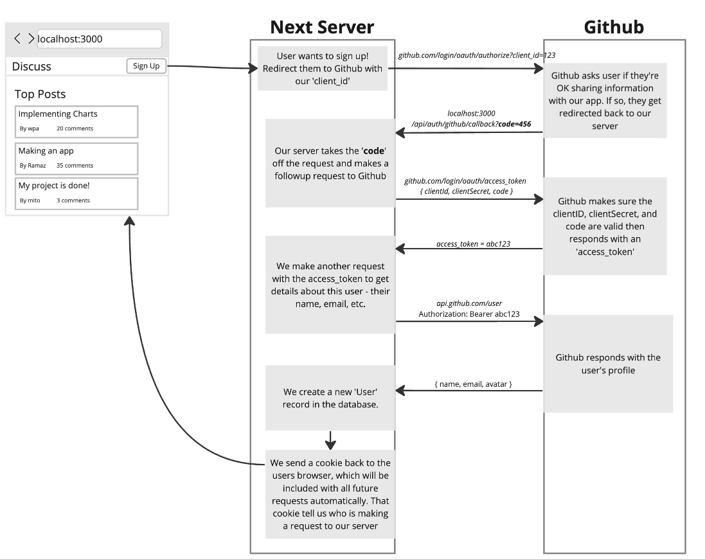
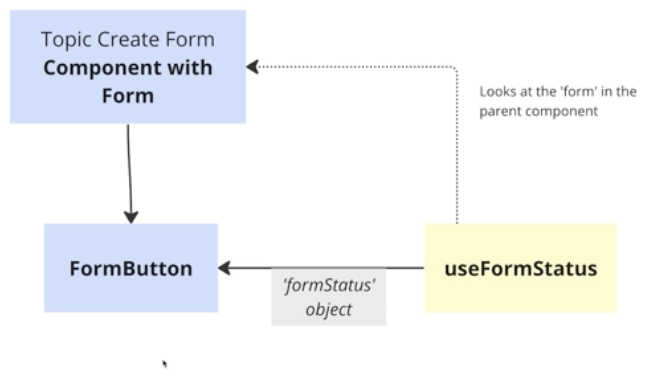
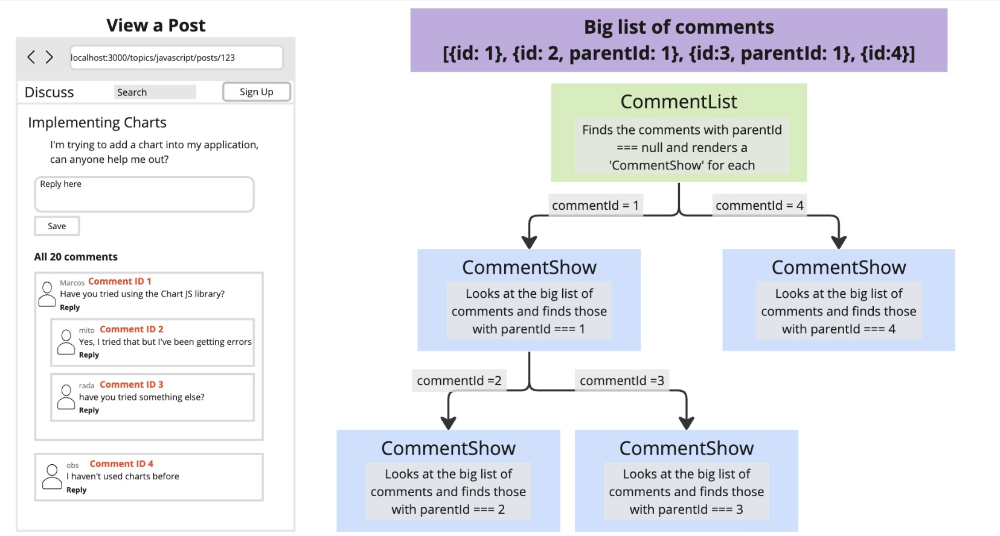

## Branches
- `main`, initial create next app setup, reset
- `corp-1`, static pages, header navbar, hero section on each page
- `snippets-app-2`, save code snippets app, CRUD for code snippets, PRISMA, SQLITE
- `auth-prisma-reddit-clone-3`, clone ap for reddit, authentication with Next-auth, PRISMA, SQLITE, NextUI components, range of CRUD for topics, posts and comments, user based.
- `auth-prisma-reddit-clone-3-cache-repeated-calls` - similar as above, with a variation of making repeated DB queries for post comments, and caching them.

### Server actions in Server forms
- server action passed to server form has default type of: `formAction: (data: FormData) => Promise<void>`
- can be passed to form: `<form action={formAction} ...>...`
- however, it may be cases when we need to pass some arbitrary parameters to our server action, other than `FormData`,
and still be able to use with the server form, we can use javascript function binding in that case
- for example:

```tsx
const myServerAction = async (customValue: Record<string ,any>, formData: FormData ) => {
   'use server'

    // some server logic
}

const MyServerForm = async (props: any) => {
  const myData: Record<string ,any> = await fetch('https://some-url.com');

  /**
   * this will bind form action to be called with custom parameter then followed by standard FormData;
   */
  const formAction = myServerAction.bind(null, myData);

  return (
    <form action={formAction}>
      <input type="text" name="firstname"/>
      <input type="text" name="lastname"/>
      <button type="submit">submit</button>
    </form>
  )
}
```

### Error handling in Server forms
- the whole point of server forms - is that they can work in browser without any JS;
- the forms are sending `FormData` into server action
- we need somehow a way to communicate from server action back to browser page if something is wrong with submit
- `React-DOM` ( not `react` ), contains a hook called `useFormState`, specifically for this, this specific hook
can run on server even if there is no JS code on browser. ( the client component still renders on server first - this is where this hook will run )
- `useFormState` will render in the form component and will have a certain form state, then when the for maction is called with `FormData` - it all will go to server, is anything wrong with submit on server - it will send back to the form page this form state, the `useFormState` will receive the updated form state and will re-render form UI showing the error.
- the example use of `useFormState` can see at branch `snippets-app-2`, `src/app/snippets/new/page.tsx`.

```ts
export const createProfileAction = async (
  formState: { message: string },
  formData: FormData,
) => {
  'use server'

  try {
    const firstname = formData.get('firstname') as string
    const lastname = formData.get('lastname') as string

    if (!firstname || !lastname) {
      throw new Error('Form values missing')
    }

    await db.profile.create({
      data: {
        firstname,
        lastname,
      },
    })
  } catch (error) {
    return { message: getErrorMessage(error) }
  }

  revalidatePath('/')
  redirect('/')
}
```
#### Then server action imported in Form component together with the `useFormState` :

```tsx
'use client'

import { useFormState } from 'react-dom'
import { createProfileAction } from '@/lib/serverActions'

const CreateForm = () => {
 const [formState, formAction] = useFormState<{message: string}, FormData>(
    createProfileAction, // this is the server action we created above
    { message: '' }, // this is initial state value
  );

  return (
    <form action={formAction}>
      <input type="text" name="firstname"/>
      <input type="text" name="lastname"/>
      <button type="submit">submit</button>
      {
        formState.message && <p className="text-red-700">{formState.message}</p>
      }
    </form>
  )

}
```

## Caching
- Data Fetch Cache: responses from network requests made by `fetch` api, stored and reused across requests
- Router Cache: 'soft' navigation between the pages, are cached in the browser and reused when a user revisits a page
- Request Memoization: eg. make 2 or more `GET` requests using `fetch` during a user's request to your server? Only one `GET` is actually executed
- Full Route Cache: AT BUILD TIME(only), NEXT decides if your route is `static` OR `dynamic`. IF it is `static`, the page result is rendered and STORED, in production user is served this stored result.
- ○  (Static): NEXT sees that this route contains only static data, so NEXT will render it at BUILD time, cache it, and serve this cached version eevery time a user is visiting that page
- ●  (SSG): Statically generated page. NEXT will render it at BUILD time, cache it, and serve this cached version eevery time a user is visiting that page
- λ  (Dynamic): NEXT sees this route contains dynamic data, so NEXT will render this page EVERY time user visits it.

### What makes a page `dynamic` ?
- using a dynamic route: `src/app/snippets/[id]/page.tsx`, `src/app/snippets/[id]/edit/page.tsx`, unless we pre-generate static params.
- calling a `dynamic function` or referencing a `dynamic variable` whe nyour route is rendered: `cookies.set()`, `cookies.delete()`, `props.searchParams`, `useSearchParams`
- assigning a special 'route segment config' options: `export const dynamic = 'force-dynamic'`, `export const revalidate = 0`
- calling `fetch` and opt-out caching: `fetch(url, { next: { revalidate: 0 }})`

### Several ways to control caching:
- time based revalidation
- on-demand revalidation
- disable caching completely

### Enable caching for dynamic routes, `generateStaticparams()`
- at BUILD time: NEXT finds all provided routes in your dynamic segment from `generateStaticparams()`, and at BUILD time renders and caches each of them.
- when user requests one of these dynamic routes - NEXT serves these cached pages


## Authentication with Next-auth

Federated login flow:




## Recommended Initial Design
1. Identify and list all different routes you want your App to have, AND data that each route should show. For example - write a table with columns ( `Page name`, `Pathname`, `Data to show` ), then page per page fill it in.

| Page name | Pathname | Data to show |
| :---:   | :---: | :---: |
| Homepage | "/"   | Many posts, Many topics|
| Topic show | "/topics/[slug]" | A single topic and many posts |
| Create post | "/topics/[slug]/posts/new" | A single topic and many posts |
| Post show | "/topics/[slug]/posts/[postId]" | Single post, and many comments |

2. Make 'path helper' functions, example:
```ts
const paths = {
  homepage: ()=> "/",
  postCreatePath: (slug:string) => `/topics/${slug}/posts/new`,
  postShowPath:  (slug:string, postId: string) => `/topics/${slug}/posts/${postId}`
}
```
3. Create your routing folder structure `pageNameDir/page.tsx` based on step 1.

4. Identify places where data changes in your app. Example: when user can click some action or submit data that causes data to change.
( - create topic form, - create post form, - create post comment form )

5. Make empty server actions for each of these places, identified in step 4.

6. Add in comments - on what paths you need to revalidate on each server action in step 5.

| Server action | Description   | Paths to revalidate    |
| :---:   | :---: | :---: |
| Create topic | Form in a modal open on homepage, on submit closes modal and stays on homepage   | "/"   |
| Create post | Form opens on a modal on topic show page, on submit closes modal and stays on topic page, needs to show updates on topic page and homepage, but on homepage we may choose to revalidate at interval |  "/topics/[slug]", but on homepage - revalidate cache each 5min   |
| Create post comment | form opens on a post page, on submit expects to display update on post page  |   "/topics/[slug]/posts/[postId]"   |


## Validation with Zod
```ts
'use server'

import { z } from 'zod'

const createTopicSchema = z.object({
  name: z
    .string()
    .min(3)
    .regex(/^[a-z-]+$/, {
      message: 'Must be lowercase letters or dashes without spaces',
    }),
  description: z
    .string()
    .min(10, { message: 'Must be at least 10 characters long' }),
})

export const createTopic = async (formData: FormData) => {
  console.log('create Topic action')
  // todo: revalidate homepage

  const result = createTopicSchema.safeParse({
    name: formData.get('name'),
    description: formData.get('description'),
  })

  if (result.success) {
    console.log('result.data :>> ', result.data)
  } else {
    console.log('result.error :>> ', result.error)
  }
}
```

### schema.safeParse()
- immediate return is `response: { success:boolean }`
- IF response.success is `true`, then response.data is the expected payload, ( `{name: string; description string }` in our case )
- IF response.success is `false`, then response.error is `{ issues: { message: string; code: string; path: string[]; ...other}[]; errors: { message: string; code: string; path: string[]; ...other}[]}`

Example:
SUCCESS
```ts
const result = createTopicSchema.safeParse({
    name: "hello",
    description: "this is the description over ten characters long",
})

console.log(result)
/**
 * {
 *  success: true,
 *  data: {name: "hello", description: "this is the description over ten characters long" }
 * }
*/
```
ERROR
```ts
const result = createTopicSchema.safeParse({
    name: "$",
    description: "a",
})

console.log(result)
/**
 * {
 *  success: false,
 *  error: [
  {
    "code": "too_small",
    "minimum": 3,
    "type": "string",
    "inclusive": true,
    "exact": false,
    "message": "String must contain at least 3 character(s)",
    "path": [
      "name"
    ]
  },
  {
    "validation": "regex",
    "code": "invalid_string",
    "message": "Must be lowercase letters or dashes without spaces",
    "path": [
      "name"
    ]
  },
  {
    "code": "too_small",
    "minimum": 10,
    "type": "string",
    "inclusive": true,
    "exact": false,
    "message": "Must be at least 10 characters long",
    "path": [
      "description"
    ]
  }
]
 * }
*/
```
These errors - are in quite specific format and may need to have some formatting logic to make it readable, BUT
we can use their provided method to return formatted error messages per each field, like below:
```ts
const result = createTopicSchema.safeParse({
    name: formData.get('name'),
    description: formData.get('description'),
  })

if (!result.success) {
  console.log('fieldErrors :>> ', result.error.flatten().fieldErrors)
}

/**
 * fieldErrors :>> {
  name: [
    'String must contain at least 3 character(s)',
    'Must be lowercase letters or dashes without spaces'
  ],
  description: [ 'Must be at least 10 characters long' ]
}
 * */
```

### Another `react-dom` hook `useFormStatus`
- `useFormStatus` hook, looks at the `<form />` in the Parent component, from where this hook is called
- the above meaning, that we cannot call this hook direct from the `<form />` rendering component
- but we need to call it from its nested child component(s), ( eg. Button or InputGroup )




### Recursive Component - Comments list
There is a flat list of comments, where some comments can be nested inside the other by indicating the `parentId` to their parent comment ID,
those that have `parentId` to `null` - are the top-level comments. So the idea is to walk depth-first, meaning that 
1. we select the top-level comments first and render them iteratively 
eg. `topLevelList.map(current=><Comment commentId={current.id} comments={allComments} />)`
2. each comment will find its children and render them iteratively and so on.



```tsx
const CommentShow = ({ commentId, comments }: IProps) => {
  const comment = comments.find((current) => current.id === commentId)

  if (!comment) return null

  const children = comments.filter((current) => current.parentId === commentId)
  const renderedChildren = children.map((child) => {
    return (
      <CommentShow key={child.id} commentId={child.id} comments={comments} />
    )
  })

  return (
    <div className="p-4 border mt-2 mb-1">
      <div className="flex gap-3">
        <Image
          src={comment.user.image || ''}
          alt="user image"
          width={40}
          height={40}
          className="w-10 h-10 rounded-full"
        />
        <div className="flex-1 space-y-3">
          <p className="text-sm font-medium text-gray-500">
            {comment.user.name}
          </p>
          <p className="text-gray-900">{comment.content}</p>

          <CommentCreateForm postId={comment.postId} parentId={comment.id} />
        </div>
      </div>
      <div className="pl-4">{renderedChildren}</div>
    </div>
  )
}
```

And the list itself:

```tsx
const CommentsList = async ({ comments }: IProps) => {
  const topLevelComments = comments.filter(
    (comment) => comment.parentId === null,
  )

  return (
    <div className="space-y-3">
      <h1 className="text-lg font-bold">All {comments.length} comments</h1>
      {topLevelComments.map((comment) => (
          <CommentShow
            key={comment.id}
            commentId={comment.id}
            comments={comments}
          />
      ))}
    </div>
  )
}
```

### Cache memoization
- automatically can be used with the built-in `fetch` function
- can be used with other functions ( like DB queries ), by using the `cache` function. ( https://nextjs.org/docs/app/building-your-application/caching#react-cache-function ), and next caching with tag: https://nextjs.org/docs/app/api-reference/functions/unstable_cache

```ts
import { cache } from 'react'
import { db } from '.'

export const getCommentsByPostId =  cache(
  (postId: string): Promise<ICommentWithAuthor[]> => {
    return db.comment.findMany({
      where: {
        postId,
      },
      select: {
        id: true,
        content: true,
        postId: true,
        parentId: true,
        user: {
          select: {
            name: true,
            image: true,
          },
        },
      },
    })
  },
)

```

This is a [Next.js](https://nextjs.org/) project bootstrapped with [`create-next-app`](https://github.com/vercel/next.js/tree/canary/packages/create-next-app).

## Getting Started

First, run the development server:

```bash
npm run dev
# or
yarn dev
# or
pnpm dev
# or
bun dev
```

Open [http://localhost:3000](http://localhost:3000) with your browser to see the result.

You can start editing the page by modifying `app/page.tsx`. The page auto-updates as you edit the file.

This project uses [`next/font`](https://nextjs.org/docs/basic-features/font-optimization) to automatically optimize and load Inter, a custom Google Font.

## Learn More

To learn more about Next.js, take a look at the following resources:

- [Next.js Documentation](https://nextjs.org/docs) - learn about Next.js features and API.
- [Learn Next.js](https://nextjs.org/learn) - an interactive Next.js tutorial.

You can check out [the Next.js GitHub repository](https://github.com/vercel/next.js/) - your feedback and contributions are welcome!

## Deploy on Vercel

The easiest way to deploy your Next.js app is to use the [Vercel Platform](https://vercel.com/new?utm_medium=default-template&filter=next.js&utm_source=create-next-app&utm_campaign=create-next-app-readme) from the creators of Next.js.

Check out our [Next.js deployment documentation](https://nextjs.org/docs/deployment) for more details.
